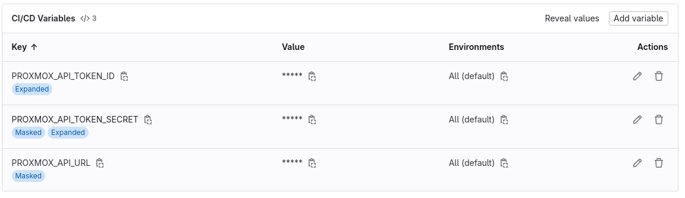

# Packer in GitLab

There are multiple steps to getting this working. Let's hope I've not forgotten any

Huge thanks to the guidance of this public repo: <https://gitlab.com/Saderi/packer-proxmox>

## TO DO

- change env variables to `PKR_VAR` variables and get rid of file templating

## API Key in Proxmox

## Packer

First off, packer needs to be working! ADD MORE HERE

## Pushed to GitLab

The stages are tagged with my `homelab` tag so that my self-hosted runners are used

<https://gitlab.com/spicyFajitas/packer>

## Sensitive Environment Variables



## Shell Profile Issues

> For certain executors, the runner passes the --login flag as shown above, which also loads the shell  profile. Anything that you have in your .bashrc, .bash_logout, or any other dotfile, is executed in your job.
> 
> If a job fails on the Prepare environment stage, it is likely that something in the shell profile is causing the failure. A common failure is when there is a .bash_logout that tries to clear the console.
> 
> To troubleshoot this error, check /home/gitlab-runner/.bash_logout. For example, if the .bash_logout file has a script section like the following, comment it out and restart the pipeline:
> 
> <https://docs.gitlab.com/runner/shells/index.html#shell-profile-loading>

## Self-Hosted Runner with Access to Proxmox

```bash
apt update && apt upgrade -y
apt install curl
apt install git
apt install vim
apt install gnupg
sudo curl -L --output /usr/local/bin/gitlab-runner https://gitlab-runner-downloads.s3.amazonaws.com/latest/binaries/gitlab-runner-linux-amd64
sudo chmod +x /usr/local/bin/gitlab-runner
useradd --comment 'GitLab Runner' --create-home gitlab-runner --shell /bin/bash
sudo gitlab-runner install --user=gitlab-runner --working-directory=/home/gitlab-runner
gitlab-runner start
gitlab-runner register  --url https://gitlab.com  --token {{ token_variable }}
gitlab-runner run
ls
cd /home/gitlab-runner/

echo "" > /home/gitlab-runner/.bash_logout
cat <<EOF >> /home/gitlab-runner/.bash_logout
# ~/.bash_logout: executed by bash(1) when login shell exits.

# when leaving the console clear the screen to increase privacy

#if [ "$SHLVL" = 1 ]; then
#    [ -x /usr/bin/clear_console ] && /usr/bin/clear_console -q
#fi
EOF

curl -fsSL https://apt.releases.hashicorp.com/gpg | sudo apt-key add -
chown -R gitlab-runner:gitlab-runner /home/gitlab-runner/
sudo apt-get install software-properties-common
sudo apt-add-repository "deb [arch=amd64] https://apt.releases.hashicorp.com $(lsb_release -cs) main"
sudo apt-get update && sudo apt-get install packer
packer
mkdir /home/adam
mkdir /home/adam/.ssh
cd /home/adam/.ssh/
vim id_ed25519
# make sure this host has ssh keys that can be used on packer machines
gitlab-runner run
```
